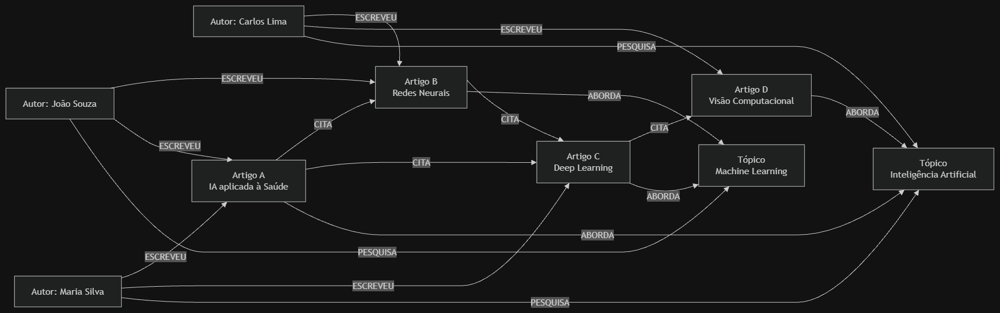
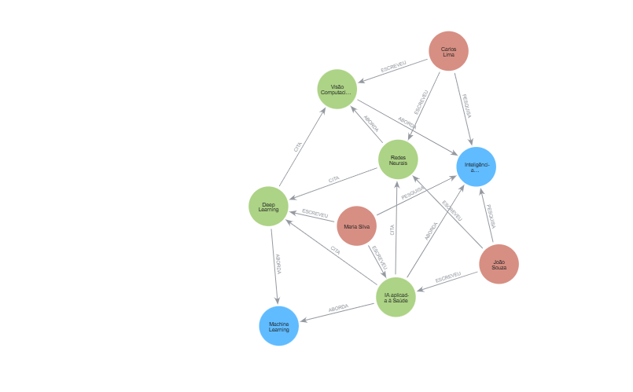

# O Mundo em Grafos e o Paradoxo Relacional
Grupo 6 – Grafos de Conhecimento Acadêmico (Knowledge Graphs)

Alunos: Arthur Felipe Vitoria
, Uzires Portugal Laureano 

Tema: Grafos de Conhecimento Acadêmico

Cenário: Relacionamento entre artigos científicos, autores e citações.

# 1. Introdução

A produção científica gera uma grande quantidade de informações que estão diretamente relacionadas entre si. Um artigo pode possuir vários autores, citar diversos outros artigos e abordar diferentes assuntos. Da mesma forma, um pesquisador pode participar de vários artigos e trabalhar com diferentes temas.

Nesse cenário, o relacionamento entre as informações possui grande importância. Não basta saber quais artigos existem ou quem são os autores. Também é necessário entender quem escreveu cada artigo, quais trabalhos foram citados, quais assuntos estão relacionados e como essas informações se conectam.

Para representar esse cenário, este trabalho propõe a utilização de um Grafo de Conhecimento Acadêmico (Knowledge Graph). O objetivo é representar autores, artigos e tópicos como nós e suas relações como arestas, permitindo analisar a rede de conhecimento e identificar pesquisadores que possuem maior influência em determinado assunto.
# 2. O Problema de Negócio

Uma plataforma acadêmica responsável pelo armazenamento de milhões de artigos científicos publicados por pesquisadores de diferentes universidades e instituições precisa lidar com uma grande quantidade de informações interligadas. Nesse contexto, não é suficiente apenas armazenar os dados referentes aos artigos, autores e assuntos abordados, sendo necessário também compreender as relações existentes entre essas entidades. A plataforma deve permitir a identificação de pesquisadores relevantes em determinados tópicos, a análise dos artigos mais citados, o relacionamento entre diferentes autores e a identificação das conexões existentes entre trabalhos científicos por meio de suas citações.

Esse cenário se torna mais complexo à medida que a quantidade de informações aumenta. Um único artigo pode possuir diversos autores e citar dezenas ou até centenas de outros trabalhos. Esses trabalhos, por sua vez, também possuem seus próprios autores, tópicos e referências, formando uma extensa rede de relacionamentos. Dessa forma, o principal desafio não está apenas no armazenamento das informações, mas principalmente na capacidade de consultar e analisar de maneira eficiente as relações existentes entre os diferentes elementos da produção científica.

# 3. O Paradoxo Relacional

Em um banco de dados relacional tradicional, as informações desse cenário poderiam ser organizadas em diferentes tabelas, como `AUTORES`, `ARTIGOS`, `TOPICOS`, `AUTORES_ARTIGOS`, `ARTIGOS_TOPICOS` e `CITACOES`. A tabela `AUTORES_ARTIGOS`, por exemplo, seria utilizada para representar a relação muitos-para-muitos existente entre autores e artigos, considerando que um pesquisador pode participar de diversos trabalhos e que um mesmo artigo pode possuir vários autores. Da mesma forma, a tabela `CITACOES` seria responsável por representar os relacionamentos existentes entre os artigos.

Embora esse modelo seja capaz de representar as informações necessárias, consultas que envolvem diversos níveis de relacionamento podem exigir a combinação de várias tabelas por meio de operações `JOIN`. Em um cenário com milhões de registros e múltiplas relações, essas consultas podem apresentar maior complexidade e aumentar o custo de processamento. De acordo com a documentação de modelagem da Neo4j, bancos de dados relacionais utilizam mecanismos como índices e operações `JOIN` para conectar diferentes entidades, o que pode se tornar mais complexo em cenários que envolvem grandes volumes de dados e consultas que atravessam diversos níveis de relacionamento. [1]

# 4. Self-Join e a Rede de Citações

Um dos principais desafios desse cenário está relacionado às citações entre artigos científicos. Um artigo pode citar outro artigo, fazendo com que uma mesma entidade se relacione com outra entidade do mesmo tipo. Em um banco de dados relacional, esse tipo de relacionamento pode exigir a utilização de um **Self-Join**, no qual uma tabela é relacionada com ela mesma para identificar as conexões existentes entre seus registros.

A rede de citações pode apresentar diferentes níveis de relacionamento. Um determinado artigo pode citar um segundo trabalho, que por sua vez cita um terceiro, estabelecendo uma sequência de conexões entre diferentes publicações. Dessa forma, uma análise pode partir de um artigo inicial e percorrer sucessivamente suas citações para identificar outros trabalhos relacionados direta ou indiretamente. À medida que a quantidade de níveis analisados aumenta, as consultas relacionais podem se tornar mais complexas, principalmente quando é necessário percorrer diferentes relações simultaneamente. Esse comportamento caracteriza uma estrutura de rede, tornando o modelo de grafos uma alternativa adequada para representar e analisar essas conexões.

# 5. Relações N:M

Outro aspecto importante do cenário acadêmico é a existência de relações muitos-para-muitos entre autores e artigos. Um pesquisador pode participar da produção de diversos artigos, enquanto um único artigo pode ser desenvolvido por vários pesquisadores. Em um banco de dados relacional, essa relação normalmente é representada por meio de uma tabela intermediária, responsável por associar os registros de autores aos registros de artigos.

No modelo de grafos, essa mesma relação pode ser representada diretamente por meio de uma aresta entre os nós correspondentes. Assim, um nó que representa um autor pode possuir uma relação `ESCREVEU` direcionada para diversos nós que representam artigos. Da mesma forma, diferentes autores podem estar conectados ao mesmo artigo. Essa representação permite que a relação entre as entidades faça parte da própria estrutura do grafo, tornando a navegação entre os dados mais direta.

# 6. Proposta do Modelo de Grafo

A solução proposta consiste na utilização de um **Grafo de Conhecimento Acadêmico (Knowledge Graph)** para representar as principais entidades e relações existentes no domínio científico. Nesse modelo, autores, artigos e tópicos são representados como nós, enquanto os relacionamentos entre essas entidades são representados por arestas direcionadas.

Um autor pode estar relacionado a um artigo por meio da relação `ESCREVEU`, indicando sua participação na produção científica. Os artigos podem estar conectados entre si por meio da relação `CITA`, representando as referências bibliográficas existentes entre os trabalhos. Além disso, um artigo pode estar relacionado a determinado tópico por meio da relação `ABORDA`, enquanto um autor pode possuir uma relação `PESQUISA` com um tópico que represente sua área de atuação ou interesse científico.

Dessa forma, o modelo permite representar não apenas as entidades presentes na base acadêmica, mas também as conexões existentes entre elas. Essa abordagem facilita a análise dos relacionamentos e possibilita a exploração da rede de conhecimento formada pelos autores, artigos, tópicos e citações. O modelo de grafos utiliza nós para representar entidades e relacionamentos para representar as conexões existentes entre elas, sendo possível também associar propriedades tanto aos nós quanto aos relacionamentos. [2]
# 7. Diagrama do Grafo

# 8. Conclusão

A produção científica possui uma grande quantidade de relacionamentos entre autores, artigos e tópicos.
Em um banco de dados relacional, essas relações podem ser representadas através de tabelas intermediárias, chaves estrangeiras, JOINs e, no caso das citações, até mesmo Self-Joins.
O problema não está na incapacidade do SQL de realizar essas operações, mas na complexidade que pode surgir quando é necessário analisar muitos níveis de relacionamento.

O banco de grafos permite representar essas dependências diretamente como conexões.
No modelo proposto, autores, artigos e tópicos são representados como nós, enquanto relações como ESCREVEU, CITA, ABORDA e PESQUISA são representadas como arestas.
Com isso, a equipe pode realizar análises de influência acadêmica, encontrar artigos relacionados, analisar redes de citações e identificar pesquisadores relevantes em determinado tópico.
Portanto, o modelo de grafos se mostra uma alternativa adequada para esse cenário porque o relacionamento entre as informações possui tanta importância quanto os dados armazenados individualmente.

# 9. Referências

[1] NEO4J. Modeling: relational to graph. Neo4j Documentation. Disponível em: https://neo4j.com/docs/getting-started/data-modeling/relational-to-graph-modeling/. Acesso em: 04 out. 2026.

[2] NEO4J. What is a graph database? Neo4j Documentation. Disponível em: https://neo4j.com/docs/getting-started/graph-database/. Acesso em: 04 out. 2026.

[3] NEO4J. What is graph data modeling? Neo4j Documentation. Disponível em: https://neo4j.com/docs/getting-started/data-modeling/. Acesso em: 04 out. 2026.

[4] NEO4J. Knowledge graphs. Neo4j. Disponível em: https://neo4j.com/use-cases/knowledge-graph/. Acesso em: 04 out. 2026.

[5]FREIXO, Marcos . JOIN não é só sintaxe: como evitar duplicações silenciosas em
relatórios corporativos. Ash3, 2026. Disponível em:
https://ash3.com.br/blog/sql-joins-relatorios/. Acesso em: 28 set. 2026.

[6]ERICKSON, Jeffrey . O que é um banco de dados de grafos?. ORACLE, 2026.
Disponível em:
https://www.oracle.com/br/autonomous-database/what-is-graph-database/ Acesso
em: 28 set. 2026.

[7]MEYRELLES, Mário . Uma gentil introdução ao uso de banco de dados orientados a
grafos com Neo4j. Medium, 2015. Disponível em:
https://medium.com/accendis-tech/uma-gentil-introdu%C3%A7%C3%A3o-ao-uso-de-banco-de-dados-orientados-a-grafos-com-neo4j-ca148df2d352. Acesso em: 28 set.
2026.
